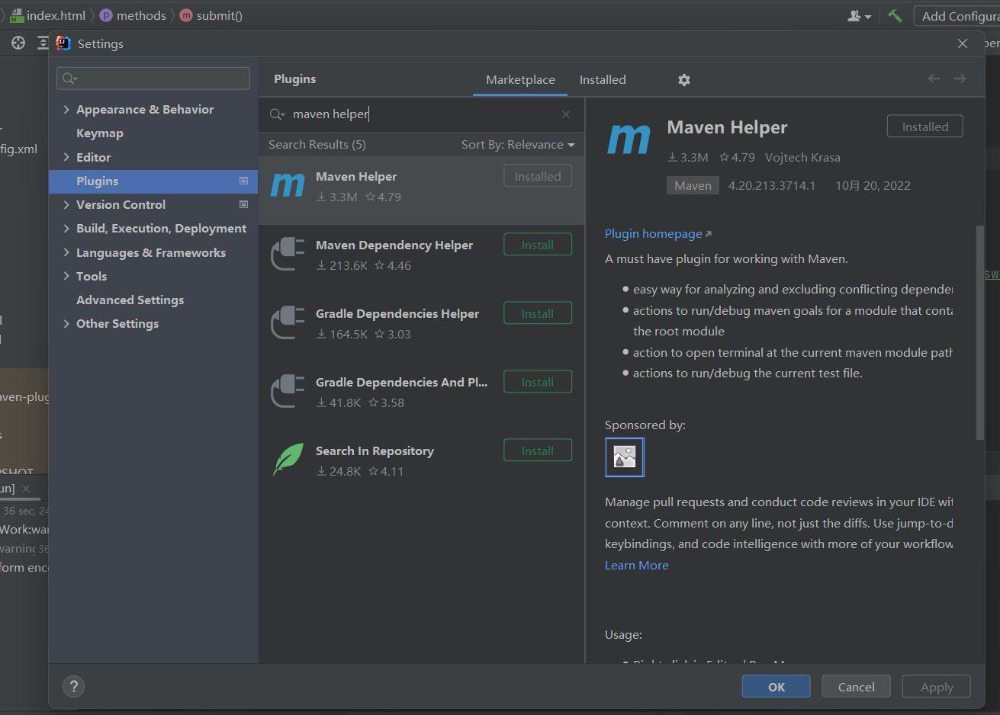
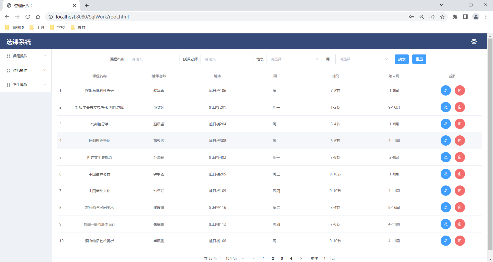

## 选课系统

------

### 基本介绍：

基于Web系统，界面分为登录界面和操作界面。总共有三种身份，包括学生、教师和管理员，使用不同的身份登录会进入不同的操作页面，实现不同操作。

------

### 主要用到的技术：

- 使用maven进行项目构建(以下是导入的依赖名)

```xml
<artifactId>tomcat7-maven-plugin</artifactId>
...
<artifactId>mysql-connector-java</artifactId>
...
<artifactId>mybatis</artifactId>
...
<artifactId>javax.servlet-api</artifactId>
```

- 使用Java,Mybatis搭建整个系统
- 使用Element-ui开发前端页面
- 使用MySQL存储数据

------

### 项目功能：

学生可以查询所有课程，选课，查看选课结果，退选。教师可以查询所有课程，查看自己教授的课程和该课程的学生名单。管理员可以完成课程信息、学生信息、教师信息的增删改查。

------

### 如何启动本系统？

1. 将sql文件在MySQL运行生成表和数据

2. 在IDEA中打开项目(Project)

3. 打开IDEA的File -> Setting -> Plugins , 然后找到Maven Helper插件并安装

   

4. 确保依赖成功导入后，在任意文件下右键选择Run Maven，二级菜单中选择tomcat7:run

   

5. 在控制台可以看到输出的

   > [INFO] Running war on *http://localhost:8080/SqlWork*

   

6. 点击即可访问系统的页面

7. 选择身份，输入导入的id和密码(一般是123456)，登录即可进入对应的页面

​	

​	
